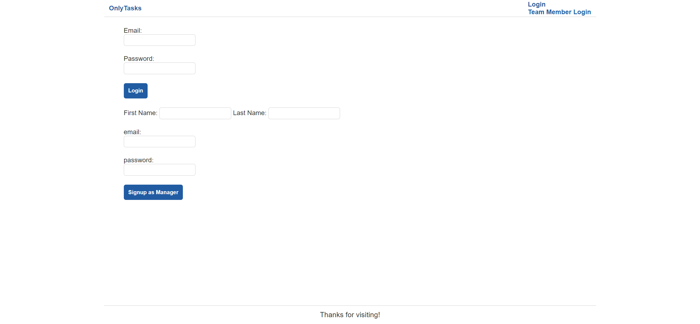
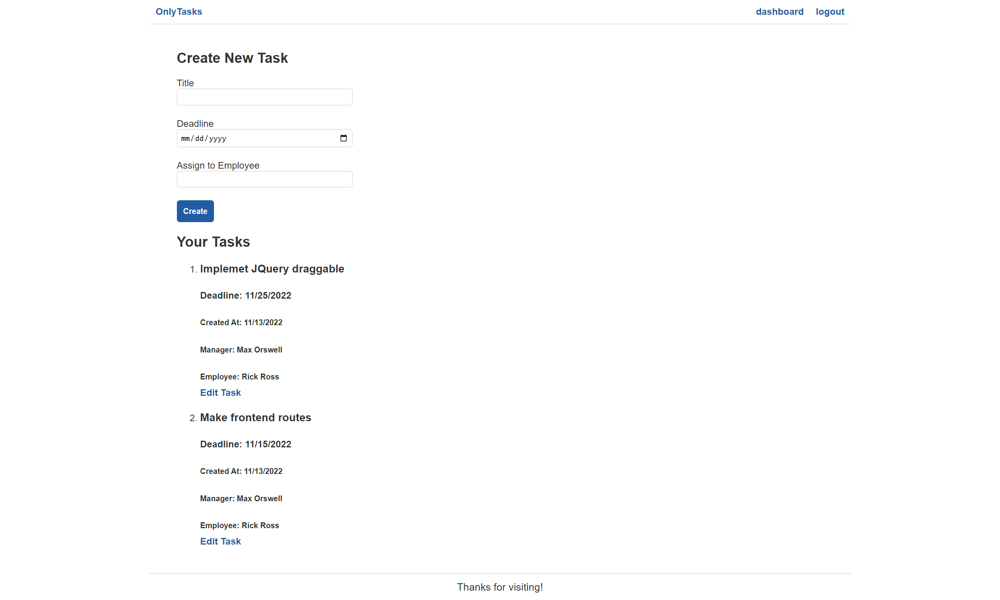

# Title
OnlyTasks

# Table of Contents
[Description](#description)

[Installation](#instalation)

[Usage](#usage)

[Heroku](#heroku)

[Contributors](#contributors)

[Tests](#tests)

[Questions](#questions)

## Description
OnlyTasks.com is dedicated to workplace efficiency. We created this application to streamline global office management initiatives, allowing managers to designate tasks, individual contributors to add daily to-do’s, and all parties to be kept abreast of project statuses.  

## Installation
Clone the repo and then upon navigating to the cloned directory, run "npm i," in order to install all the dependencies, use "npm start" and then visit localhost and port 3001 to use the website.

## Usage
For a business in which employees with team member credentials. Upon completion of a task, team members can mark them as complete. Manager accounts have been obsolete due to a lack of Javascript. Only team member account are of use . The employees account credentials can be used to log in, create tasks and assign them to various employee account.

## Heroku 
https://onlytasks.herokuapp.com/login

## Contribution
Mohammad Likon Hassan, 
Charley Chioma Ukwubiwe

## Tests
Run "npm test" to run a test for the date format function.

## Questions
GitHub: https://github.com/charleychioma 

Email: charleyroseukwu@yahoo.com
